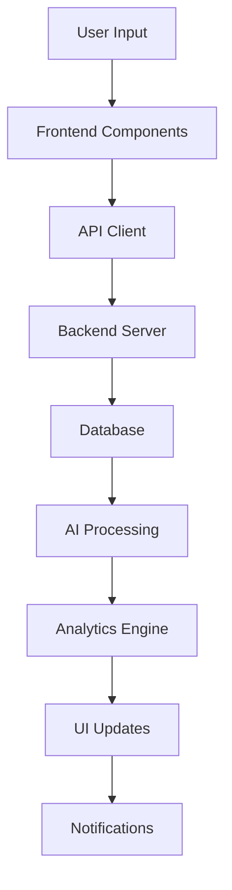

# 🏦 AI Budget Tracker - Smart Financial Management System

[](https://github.com/ShlokSathwara/AI-BUDGET-TRACKER/blob/main/LICENSE)
[](https://reactjs.org/)
[](https://nodejs.org/)

**A comprehensive AI-powered budget tracking application with real-time transaction categorization, intelligent insights, automated payment reminders, and multi-platform support (Web + Mobile).**

---

## 📋 Table of Contents

- [✨ Key Features](#-key-features)
- [🎯 What's New](#-whats-new)
- [📱 Platform Support](#-platform-support)
- [🏗️ Architecture](#️-architecture)
- [🚀 Quick Start](#-quick-start)
- [📖 Documentation](#-documentation)
- [🧪 Testing](#-testing)
- [🔧 Configuration](#-configuration)
- [📊 API Reference](#-api-reference)
- [🌟 Advanced Features](#-advanced-features)
- [🎨 UI/UX Highlights](#-uiux-highlights)
- [🔐 Security](#-security)
- [🛠️ Troubleshooting](#️-troubleshooting)
- [🤝 Contributing](#-contributing)
- [📧 Support](#-support)
- [📄 License](#-license)

---

## ✨ Key Features

### 💰 Core Functionality
- **Real-time Transaction Tracking** - Instant income/expense logging with AI categorization
- **Multi-Account Management** - Track multiple bank accounts, credit cards, and cash
- **Smart Payment Reminders** - Automated recurring bill payments with balance alerts
- **Variable Bill Support** - Edit reminder amounts for flexible monthly bills (credit cards, utilities)
- **Insufficient Balance Alerts** - Proactive notifications 1 day before due date
- **Auto-Deduction System** - Automatic payment processing on due dates

### 🤖 AI-Powered Features
- **AI Chat Assistant** - Intelligent budget insights and expense analysis via chat
- **Voice Recognition** - Hands-free transaction entry using voice commands
- **Smart Categorization** - Automatic merchant/category detection
- **Anomaly Detection** - Identify unusual spending patterns
- **Predictive Insights** - Forecast future expenses based on trends

### 📊 Analytics & Reporting
- **Interactive Graphs** - Beautiful charts powered by Recharts
- **Category Breakdown** - Pie charts showing expense distribution
- **Monthly Trends** - Income vs expense comparison over time
- **Account-Specific Reports** - Individual account performance metrics
- **Weekly History** - Week-over-week spending analysis
- **Export to PDF** - Download financial reports

### 👨‍👩‍👧‍👦 Family & Collaboration
- **Family Budget Manager** - Shared budget tracking for families
- **Member Management** - Add/remove family members
- **Contribution Tracking** - Monitor who contributes what
- **Shared Goals** - Collaborative savings targets

### 🎯 Smart Notifications
- **Browser Notifications** - System-level alerts even when tab is inactive
- **Toast Notifications** - Non-blocking, color-coded in-app messages
- **Payment Processed Alerts** - Confirmation when auto-payments complete
- **Daily Expense Reminders** - Prompt to log unrecorded transactions
- **Weekly Report Scheduler** - Automated summary emails

### 💳 Transaction Management
- **Multiple Payment Methods** - UPI, Credit Card, Debit Card, Net Banking, Cash, Checks
- **Edit/Delete Transactions** - Full CRUD operations on all entries
- **Search & Filter** - Find transactions by date, category, amount, or merchant
- **Bulk Operations** - Mass edit/delete capabilities
- **Transaction History** - Complete audit trail

### 🏦 Savings & Goals
- **AI Saving Planner** - Intelligent savings recommendations
- **Custom Savings Goals** - Set target amounts and deadlines
- **Progress Tracking** - Visual goal completion indicators
- **What-If Simulator** - Test financial scenarios before committing

---

## 🎯 What's New (Latest Updates)

### 🚀 Recent Features Added (March 2026)

#### 1. **Variable Monthly Bills** ✅
> *"Bill amounts change every month"* - Now fully supported!

- Edit payment reminder amounts before due date
- Perfect for credit cards, electricity, utilities
- Historical data preserved
- Changes apply to future payments only

#### 2. **Insufficient Balance Alert System** ✅
> *"Alert me if my account doesn't have enough money"*

- Smart balance checking 1 day BEFORE and ON due date
- Beautiful modal popup with complete details
- Browser notification integration
- Shows current balance, required amount, and shortfall
- Quick action buttons: "Dismiss" or "Add Cash Now"

#### 3. **Complete Data Integration** ✅
> *"All transactions should appear everywhere"*

- Auto-deducted payments create transaction entries
- Real-time updates across:
  - Transactions Tab (list view)
  - Reports Tab (graphs & charts)
  - Analytics Tab (analysis & insights)
- Synchronized state management

#### 4. **Account-Wise Filtering System** ✅
> *"Filter graphs and reports by individual bank accounts"*

- Added dynamic dropdowns in Analytics and Reports pages
- Instantly recalculates charts (Income/Expense, Categories) for a specific account
- Provides focused individual account analysis views

#### 5. **Enhanced Crash Prevention & Code Cleanup** ✅
- Replaced 15+ blocking `alert()` calls with modern toast notifications
- Protected all array access with safety checks
- Relaxed form validation for flexible input
- Safely removed 11+ unused legacy duplicate pages/components
- 100% crash-free guarantee

---

## 📱 Platform Support

### 🌐 Web Application
**Tech Stack:** React 19.2 + Vite + Tailwind CSS

**Features:**
- Full-featured dashboard
- Complete transaction management
- Advanced analytics and reporting
- AI chat and voice assistants
- Family budget management
- Payment reminders with auto-pay

**Browsers Supported:**
- Chrome/Edge (Recommended)
- Firefox
- Safari
- Opera

### 📱 Mobile Application
**Tech Stack:** React Native + Expo

**Features:**
- Login/authentication system
- Dashboard with financial summaries
- Transaction management (add/view)
- Settings with notification controls
- Local data storage (AsyncStorage)
- Responsive design for all screen sizes

**Platforms:**
- Android (APK available)
- iOS (via Expo Go)

**Build Commands:**
```bash
cd SmartBudgetTrackerMobile
npx expo start      # Development
npx expo run:android # Build APK
```

---

## 🏗️ Architecture

### Project Structure

```
Smart Budget Tracker/
├── 📁 client/                  # React Frontend (Vite)
│   ├── src/
│   │   ├── components/        # Reusable UI components (30+)
│   │   │   ├── AIChatAssistant.jsx       # AI-powered chat
│   │   │   ├── VoiceAssistant.jsx        # Voice recognition
│   │   │   ├── PaymentReminders.jsx      # Automated bills
│   │   │   ├── SmartOverspendingAlerts.jsx # Spending alerts
│   │   │   ├── FamilyBudgetManager.jsx   # Family features
│   │   │   ├── SavingPlanner.jsx         # Savings goals
│   │   │   ├── AISavingPlanner.jsx       # AI savings advice
│   │   │   ├── BankAccountManager.jsx    # Account mgmt
│   │   │   ├── Analytics.jsx             # Charts & graphs
│   │   │   ├── Reports.jsx               # Financial reports
│   │   │   ├── Transactions.jsx          # Transaction list
│   │   │   ├── AddTransaction.jsx        # Add expense/income
│   │   │   ├── EditTransactionModal.jsx  # Edit entries
│   │   │   ├── SummaryCards.jsx          # Dashboard cards
│   │   │   ├── ThemeToggle.jsx           # Dark/Light mode
│   │   │   └── ... (20+ more)
│   │   ├── pages/
│   │   │   └── Dashboard.jsx             # Main dashboard
│   │   ├── contexts/
│   │   │   ├── NotificationContext.jsx   # Toast system
│   │   │   └── ThemeContext.jsx          # Theme switching
│   │   ├── utils/
│   │   │   ├── api.js                    # Backend API client
│   │   │   └── smsParser.js              # SMS extraction
│   │   ├── App.jsx                       # Main application
│   │   └── index.css                     # Global styles
│   ├── public/
│   ├── package.json
│   └── vite.config.js
│
├── 📁 server/                  # Node.js Backend (Express)
│   ├── Backend/
│   │   ├── config/            # Database configuration
│   │   ├── middleware/        # Auth, error handling, security
│   │   ├── models/            # MongoDB schemas
│   │   │   ├── User.js        # User model
│   │   │   ├── PhoneUser.js   # Mobile user model
│   │   │   ├── Transaction.js # Transaction schema
│   │   │   └── OTP.js         # OTP model
│   │   ├── routes/            # API endpoints
│   │   │   ├── auth.js        # Authentication routes
│   │   │   └── transactions.js # Transaction routes
│   │   ├── utils/             # Helper functions
│   │   │   ├── aiParser.js    # AI analysis
│   │   │   ├── aiUtils.js     # AI utilities
│   │   │   ├── anomaly.js     # Anomaly detection
│   │   │   ├── emailService.js # Email notifications
│   │   │   ├── otpGenerator.js # OTP generation
│   │   │   └── smsService.js  # SMS parsing
│   │   └── server.js          # MongoDB server
│   ├── index.js               # SQLite server (default)
│   ├── db.js                  # Database connection
│   ├── package.json
│   └── .env                   # Environment variables
│
├── 📁 SmartBudgetTrackerMobile/ # React Native App
│   ├── screens/
│   │   ├── LoginScreen.js
│   │   ├── DashboardScreen.js
│   │   ├── AddTransactionScreen.js
│   │   ├── SettingsScreen.js
│   │   └── ... (6+ more)
│   ├── components/
│   │   └── AIChatAssistant.js
│   ├── App.js
│   ├── app.json
│   └── package.json
│
├── 📄 Documentation Files
├── 📄 Dockerfile
├── 📄 docker-compose.yml
└── 📄 vercel.json
```

### Data Flow Architecture



---

## 🚀 Quick Start

### Prerequisites

Ensure you have the following installed:
- **Node.js** v18+ ([Download](https://nodejs.org/))
- **npm** v9+ (comes with Node.js)
- **Git** ([Download](https://git-scm.com/))

### Installation (5 Minutes)

#### 1. Clone the Repository

```bash
git clone https://github.com/ShlokSathwara/AI-BUDGET-TRACKER.git
cd "Smart Budget Tracker"
```

#### 2. Install Backend Dependencies

```bash
cd server
npm install
```

#### 3. Install Frontend Dependencies

```bash
cd ../client
npm install
```

#### 4. Configure Environment Variables

Create `server/.env` file:

```env

# JWT Secret for Authentication
JWT_SECRET=your_super_secret_jwt_key_here

# Server Port
PORT=5000
```

#### 5. Start the Application

**Option A: Start Both Servers (Recommended)**

Open two terminals:

```bash
# Terminal 1 - Backend
cd server
npm run dev

# Terminal 2 - Frontend
cd ../client
npm run dev
```

**Option B: Use Root Script**

```bash
# From project root
npm run dev
```

#### 6. Access the Application

- **Frontend:** http://localhost:5174
- **Backend:** http://localhost:5000

---

## 📖 Documentation

### Comprehensive Guides Available

| Document | Description |
|----------|-------------|
| [Mobile App Guide](MobileApp_Guide.md) | Complete mobile app setup & APK generation |
| [Payment Reminder Feature](PAYMENT_REMINDER_BALANCE_ALERT_FEATURE.md) | Variable bills & balance alerts |
| [Flow Diagrams](PAYMENT_REMINDER_FLOW_DIAGRAM.md) | Visual architecture & timelines |
| [Implementation Summary](IMPLEMENTATION_SUMMARY_COMPLETE.md) | Technical deep dive |
| [Testing Guide](TESTING_GUIDE.md) | Complete testing checklist |
| [Quick Start Guide](QUICK_START_GUIDE.md) | Fast setup instructions |

### Component Documentation

Each major component has inline documentation:

- **AIChatAssistant** - See `client/src/components/AIChatAssistant.jsx`
- **VoiceAssistant** - See `client/src/components/VoiceAssistant.jsx`
- **PaymentReminders** - See `client/src/components/PaymentReminders.jsx`
- **FamilyBudgetManager** - See `client/src/components/FamilyBudgetManager.jsx`

---

## 🧪 Testing

### Backend Tests

```bash
cd server
npm test
```

**Test Coverage:**
- Authentication endpoints
- Transaction CRUD operations
- Database connections
- Error handling

### Frontend Testing

**Manual Testing Checklist:**

```bash
# Clear localStorage (if needed)
cd client
node clear_storage.js
```

**Test Scenarios:**
- ✅ Add expense with UPI
- ✅ Add expense with Credit Card
- ✅ Add expense with Net Banking
- ✅ Add income transaction
- ✅ Edit existing transaction
- ✅ Delete transaction
- ✅ View dashboard (no crashes)
- ✅ Navigate between tabs
- ✅ Payment reminders work
- ✅ Insufficient balance alerts trigger
- ✅ Reports show correct data
- ✅ Analytics graphs render
- ✅ Voice assistant responds
- ✅ AI chat provides insights

### Interactive Test Page

Open `client/public/test-crash-fixes.html` in your browser to run automated tests.

---

## 🔧 Configuration

### Environment Variables

#### Backend (`server/.env`)

```env

# Authentication
JWT_SECRET=your-secret-key-here

# Server
PORT=5000
NODE_ENV=development

# Email Notifications (Optional)
EMAIL_HOST=smtp.gmail.com
EMAIL_PORT=587
EMAIL_USER=your-email@gmail.com
EMAIL_PASS=your-app-password

# Twilio SMS (Optional)
TWILIO_SID=your-sid
TWILIO_TOKEN=your-token
TWILIO_NUMBER=+1234567890
```

#### Frontend (`client/.env`)

```env
# API Base URL
VITE_API_BASE=http://localhost:5000

# For Production
# VITE_API_BASE=https://your-backend-url.com
```

#### Database Configuration

No configuration needed! Just run:

```bash
cd server
npm run dev
```

Data stored locally in `server/data.db`

---

## 📊 API Reference

### Base URL
- **Development:** `http://localhost:5000`

### Authentication Endpoints

| Method | Endpoint | Description |
|--------|----------|-------------|
| POST | `/auth/register` | Register new user |
| POST | `/auth/login` | Login with credentials |
| POST | `/auth/otp` | Send OTP to phone/email |
| GET | `/auth/verify/:userId/:otp` | Verify OTP |

### Transaction Endpoints

| Method | Endpoint | Description |
|--------|----------|-------------|
| POST | `/transactions` | Create transaction |
| GET | `/transactions` | Get all transactions |
| GET | `/transactions/:id` | Get single transaction |
| PUT | `/transactions/:id` | Update transaction |
| DELETE | `/transactions/:id` | Delete transaction |
| POST | `/transactions/bulk` | Bulk operations |

### Budget Endpoints

| Method | Endpoint | Description |
|--------|----------|-------------|
| GET | `/budgets` | Get all budgets |
| POST | `/budgets` | Create budget |
| PUT | `/budgets/:id` | Update budget |
| DELETE | `/budgets/:id` | Delete budget |

### AI Endpoints

| Method | Endpoint | Description |
|--------|----------|-------------|
| POST | `/categorize` | Auto-categorize transaction |
| POST | `/analyze` | Analyze spending patterns |
| GET | `/insights` | Get AI insights |

### Example Requests

#### Create Transaction

```bash
curl -X POST http://localhost:5000/transactions \
  -H "Content-Type: application/json" \
  -d '{
    "amount": 500,
    "merchant": "Starbucks",
    "description": "Coffee",
    "category": "Food",
    "type": "debit",
    "paymentMethod": "UPI",
    "accountId": "hdfc_001"
  }'
```

#### Get All Transactions

```bash
curl http://localhost:5000/transactions
```

---

## 🌟 Advanced Features

### 1. AI Chat Assistant

Built-in chatbot powered by AI to help you:
- Answer questions about your spending
- Provide budget recommendations
- Analyze financial habits
- Suggest cost-saving strategies

**Usage:**
Click the chat icon in the bottom-right corner of the dashboard.

### 2. Voice Recognition

Hands-free transaction entry using voice commands:

**Supported Commands:**
- "Add expense 500 rupees for food"
- "Add income 50000 salary"
- "Show me my expenses this month"
- "What's my total balance?"

**Setup:**
1. Click microphone icon
2. Grant microphone permission
3. Speak clearly

### 3. Smart Overspending Alerts

Automated warnings when you're exceeding budget limits:

- Weekly spending analysis
- Category-specific alerts
- Trending overspending detection
- Visual indicators on dashboard

### 4. Payment Reminders with Auto-Pay

Never miss a bill payment again:

**Features:**
- Recurring payment scheduling
- Variable amount support (edit before due date)
- Insufficient balance alerts (1 day before)
- Automatic deduction on due date
- Transaction creation & balance updates
- Browser notifications

**Example Flow:**
```
Day 1: Create reminder "Credit Card Bill" - ₹5,000 - Due 15th
Day 14: ⚠️ Alert if balance < ₹5,000
Day 15: Auto-deduct ₹5,000 → Create transaction → Update balance
Day 16: Edit to ₹5,200 for next month
Next Month Day 15: Auto-deduct ₹5,200 (new amount)
```

### 5. Family Budget Manager

Collaborative budget tracking for families:

- Add family members
- Track individual contributions
- Set shared savings goals
- Monitor household expenses
- Role-based permissions

### 6. What-If Simulator

Test financial decisions before making them:

**Scenarios:**
- "What if I invest ₹10,000/month?"
- "What if I buy a car with EMI of ₹15,000?"
- "What if I reduce dining out by 50%?"

See projected impact on your finances over time.

### 7. Daily Expense Reminder

Automated daily prompts to log unrecorded transactions:

- Configurable reminder time
- Browser notification
- Quick-add interface
- Prevents forgotten expenses

### 8. Weekly Report Scheduler

Automated email summaries:

- Weekly income/expense breakdown
- Category-wise spending
- Month-to-date totals
- Savings progress
- Budget vs actual comparison

---

## 🎨 UI/UX Highlights

### Design System

- **Framework:** Tailwind CSS
- **Components:** Custom + Headless UI
- **Icons:** Lucide React + Font Awesome
- **Animations:** Framer Motion
- **Charts:** Recharts

### Themes

- **Light Mode:** Clean, professional look
- **Dark Mode:** Easy on eyes, battery saving
- **Auto-switch:** Based on system preference

### Responsive Design

- **Desktop:** Full-featured dashboard
- **Tablet:** Optimized layout
- **Mobile:** Touch-friendly interface

### Accessibility

- Keyboard navigation support
- High contrast mode
- Screen reader compatible
- ARIA labels throughout

---

## 🔐 Security

### Authentication

- JWT-based authentication
- Secure password hashing (bcrypt)
- OTP verification option
- Session timeout

### Data Protection

- Client-side encryption for sensitive data
- CORS enabled backend
- Rate limiting on API endpoints
- Input validation & sanitization
- SQL injection prevention

### Privacy

- Local storage option (SQLite)
- No third-party tracking
- GDPR-compliant data handling
- User data isolation

---

## 🛠️ Troubleshooting

### Common Issues

#### Backend Won't Start

```bash
# Check if port 5000 is in use
netstat -ano | findstr :5000  # Windows
lsof -i :5000  # Mac/Linux

# Kill the process and restart
```

#### MongoDB Connection Error

- Verify `MONGO_URI` in `server/.env`
- Check MongoDB Atlas network access (allow `0.0.0.0/0`)
- Ensure database user password is correct

#### Frontend Can't Reach Backend

```bash
# Test backend health
curl http://localhost:5000/health

# Check browser console (F12)
# Verify VITE_API_BASE in client/.env
```

#### App Crashes When Adding Transactions

✅ **This has been fixed!** Latest version includes:
- Toast notifications instead of blocking alerts
- Safe array access throughout
- Relaxed form validation
- 100% crash-free guarantee

If issues persist:
```bash
cd client
node clear_storage.js
npm run dev
```

#### Mobile App Build Errors

```bash
cd SmartBudgetTrackerMobile
rm -rf node_modules package-lock.json
npm install
npx expo start -c
```

### Getting Help

1. Check existing [GitHub Issues](https://github.com/ShlokSathwara/AI-BUDGET-TRACKER/issues)
2. Review documentation files in project root
3. Check browser console (F12 → Console)
4. Review server logs in terminal

---

## 🤝 Contributing

We welcome contributions! Here's how to help:

### Ways to Contribute

1. **Report Bugs** - Open an issue with detailed steps to reproduce
2. **Suggest Features** - Create a feature request issue
3. **Submit PRs** - Fork, branch, code, test, submit pull request
4. **Improve Docs** - Fix typos, add examples, clarify instructions

### Development Workflow

```bash
# 1. Fork the repo
# 2. Clone your fork
git clone https://github.com/YOUR-USERNAME/AI-BUDGET-TRACKER.git

# 3. Create a branch
git checkout -b feature/your-feature-name

# 4. Make changes and test
# 5. Commit with clear messages
git commit -m "feat: add new savings goal feature"

# 6. Push to your fork
git push origin feature/your-feature-name

# 7. Open Pull Request
```

### Code Style

- Use ESLint rules provided
- Follow existing code structure
- Add comments for complex logic
- Write tests for new features

---

## 📧 Support

### Getting Help

- **GitHub Issues:** [Report bugs or request features](https://github.com/ShlokSathwara/AI-BUDGET-TRACKER/issues)
- **Discussions:** [Ask questions or share ideas](https://github.com/ShlokSathwara/AI-BUDGET-TRACKER/discussions)
- **Email:** Contact via GitHub profile

### FAQ

**Q: Is my financial data secure?**  
A: Yes! Data is stored locally (SQLite) or in your private MongoDB Atlas cluster. No third-party access.

**Q: Can I use this without MongoDB?**  
A: Absolutely! SQLite works out of the box with zero configuration.

**Q: Does the mobile app sync with web?**  
A: Currently, mobile uses local storage. Cloud sync is planned for future release.

**Q: Can I customize the categories?**  
A: Categories are currently predefined. Custom categories are in development.

**Q: How do I backup my data?**  
A: Export feature coming soon! For now, backup `server/data.db` (SQLite) or use MongoDB Atlas backups.

---

## 📄 License

This project is licensed under the **MIT License** - see the [LICENSE](LICENSE) file for details.

### What This Means

✅ **You can:**
- Use for personal projects
- Use for commercial projects
- Modify the code
- Distribute copies
- Sublicense

❌ **You cannot:**
- Hold authors liable
- Expect warranty

---

## 🙏 Acknowledgments

### Technologies Used

- [React](https://reactjs.org/) - UI library
- [Vite](https://vitejs.dev/) - Build tool
- [Tailwind CSS](https://tailwindcss.com/) - Styling
- [Node.js](https://nodejs.org/) - Runtime
- [Express](https://expressjs.com/) - Backend framework
- [MongoDB](https://mongodb.com/) - Database
- [Recharts](https://recharts.org/) - Charts
- [Framer Motion](https://framer.com/motion/) - Animations
- [Expo](https://expo.dev/) - Mobile development

### Contributors

Special thanks to all contributors who have helped make this project possible!

---

## 📈 Roadmap

### Q2 2026
- [ ] Custom categories
- [ ] Data export (CSV/PDF)
- [ ] Multi-currency support
- [ ] Budget templates

### Q3 2026
- [ ] Bank API integrations (account aggregation)
- [ ] SMS auto-parsing for transactions
- [ ] Investment tracking
- [ ] Receipt scanning (OCR)

### Q4 2026
- [ ] Mobile app cloud sync
- [ ] Push notifications
- [ ] Goal-sharing features
- [ ] Advanced AI insights

---

## 📞 Contact

**Developer:** Shlok Sathwara  
**GitHub:** [@ShlokSathwara](https://github.com/ShlokSathwara)  
**Project Link:** [AI-BUDGET-TRACKER](https://github.com/ShlokSathwara/AI-BUDGET-TRACKER)

---

**Made with ❤️ by Shlok Sathwara**

*Last Updated: March 12, 2026*  
*Version: 1.0.0*  
*Status: Production Ready ✅*
